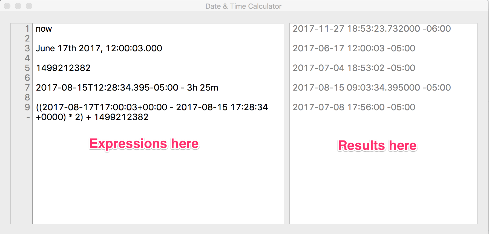

# TimeCalc

A scratch pad for time and date calculations.

See the bottom of this page for information on building.

Type expressions on the left, see the results on the right.

## Syntax

One expression per line.

Comments start with # and run to the end of the line.

Datetimes, durations and arithmetic operations on them are supported.

### Parsed Formats

Some examples. First of all, parsing dates.  All of the formats below are understood.

    # Standard iso format -> 2017-06-17 17:00:03 -05:00
    2017-06-17T17:00:03-05:00
    # Also with UTC -> 2017-06-17 14:00:03 -05:00
    2017-06-17T19:00:03Z
    # And millisecond precision -> 2017-08-15 12:28:34.395000 -05:00
    2017-08-15T12:28:34.395-05:00
    # Very similar to above but with spaces -> 2017-08-15 12:28:34 -05:00
    2017-08-15 17:28:34 +0000
    # And again with milliseconds -> 2017-08-15 12:28:34.456 -05:00
    2017-08-15 17:28:34.456 +0000
    # A format that Kibana likes with the name of the month -> 2017-06-17 12:00:03 -05:00
    June 17th 2017, 12:00:03.000
    # Bamboo's date format (assumed current timezone) -> 2017-07-20 22:02:26 -05:00
    20-Jul-2017 22:02:26
    # Format from Sentry -> 2017-09-29 09:00:23 -05:00
    Sep 29, 2017 2:00:23 PM UTC
    # Milliseconds since epoch. 13 digits  -> 2017-07-04 18:53:02.123000 -05:00
    1499212382123
    # And seconds since epoch. 10 digit -> 2017-07-04 18:53:02 -05:00
    1499212382
    # Microseconds since epoc is also supported. 16 digits. This is the format of a Cassandra command line timestamp.
    # Just a date is treated as midnight current timezone -> 2017-09-03 00:00:00 -05:00
    2017-09-03

### Durations

Durations are written as a combination of days, hours, minutes, seconds and milliseconds.
Each piece of a duration must have a unit. The suffixes for units are d (dayss), h (hour), m (minutes),
s (seconds) and ms (milliseconds)

    # Two days -> 2d
    2d
    # Three days and 1 hour -> 3d 1h
    3d 1h
    # Intermediate units can be omitted. One day and 3 minutes -> 1d 3m
    1d 3m
    # All of the possible units -> 2d 1h 15m 23s 245ms
    2d 1h 15m 23s 245ms

### Arithmetic

You can add durations to dates, subtract durations from dates and subtract dates from dates.
You can divide and multiply durations. Parentheses work.

    # Add 2 days to date -> 2017-06-19 12:00:03 -05:00
    June 17th 2017, 12:00:03.000 + 2d
    # Subtract 3 hours and 25 minutes from a date -> 2017-08-15 09:03:34.395000 -05:00
    2017-08-15T12:28:34.395-05:00 - 3h 25m
    # Subtract one date from another -> -1mo 4w 28m 31s
    2017-06-17T17:00:03+00:00 - 2017-08-15 17:28:34 +0000
    # Twice the difference between two dates added to a third date -> 2017-07-08 17:56:00 -05:00
    ((2017-08-17T17:00:03+00:00 - 2017-08-15 17:28:34 +0000) * 2) + 1499212382
    
### Timezone display

Results can be shown in different timezone using abbreviations or names.

    # Convert to central daylight time -> 2017-06-17 14:00:03.340000 -05:00
    2017-06-17 12:00:03.340 -07:00 @ "CDT"
    # Use the timezone name -> 2017-06-17 14:00:03.340000 -05:00
    2017-06-17 12:00:03.340 -07:00 @ "America/Chicago"

### Elapsed since epoc

You can convert a date to the seconds/milliseconds since the epoc by using `. s` or `. ms` after the date.
Dates converted to seconds/milliseconds don't have a following unit because they represent dates,
with a unit they would be interpreted as durations.

    # Seconds since epoc -> 1497745983
    (2017-06-17T19:00:03 + 33m) . s
    # Milliseconds since epoc -> 1502818114395
    2017-08-15T12:28:34.395-05:00 . ms

### Day of the week

You can find the day of the week for a date using  `. day`.

    # Day of the week -> Sunday
    2017-09-03 . day
    # -> Tuesday
    2017-08-15T12:28:34.395-05:00 . day

### Duration conversion

You can convert a duration into day, hours, minutes, seconds or milliseconds. If the duration can't be completely
expressed in the chosen unit then the remaining milliseconds are also shown.

    # How many seconds in 14 hours -> 50400s
    14h . s
    # How many minutes between two dates -> 2851m 29000ms
    (2017-08-17T17:00:03+00:00 - 2017-08-15 17:28:34 +0000) . m
    # As days? -> 1d 84689000ms
    (2017-08-17T17:00:03+00:00 - 2017-08-15 17:28:34 +0000) . d
    # Remaining milliseconds can be parsed -> 29s
    29000ms
    # And -> 23h 31m 29s
    84689000ms
    
### Variables

Variables can be defined. The right hand side after the = can be any expression.

    # define x -> 2017-09-03 00:00:00 -05:00
    let x = 2017-09-03
    # use it -> Sunday
    x . day

There are seven reserved variables whose values you can't change `now`, `day`, `d`, `h`, `m`, `s`, and `ms`.
There's also one special variable `fmt` whose value you can modify but which has special effects.

    # now shows the current date and time. Maybe -> 2017-11-12 19:21:52.185000 -06:00
    now
    # It can be used in expressions like any variable. Maybe -> 2017-11-12 22:34:57.161000 -06:00
    now + 3h 2m

### Output formats

The `fmt` variable controls the output format for dates.

    # Format to show just the date -> yyyy-MM-dd
    let fmt = "yyyy-MM-dd"
    # What does it show? -> 2017-08-15
    2017-08-15 17:28:34 +0000
    # Go back to the default formats -> <nothing>
    let fmt = ""
    # What does it show? -> 2017-08-15 12:28:34 -05:00
    2017-08-15 17:28:34 +0000
    # or use singe quotes. Single and double quotes work the same way.
    let fmt = ''

## Building

The only requirement beyond Xcode is [jekyll](https://jekyllrb.com) which is used together with the [Jekyll Apple Help](https://github.com/chuckhoupt/jekyll-apple-help) templates to  generate the OS X help docs. You can just follow the [jekyll installation instructions](https://jekyllrb.com/docs/installation/) to install jekyll.
