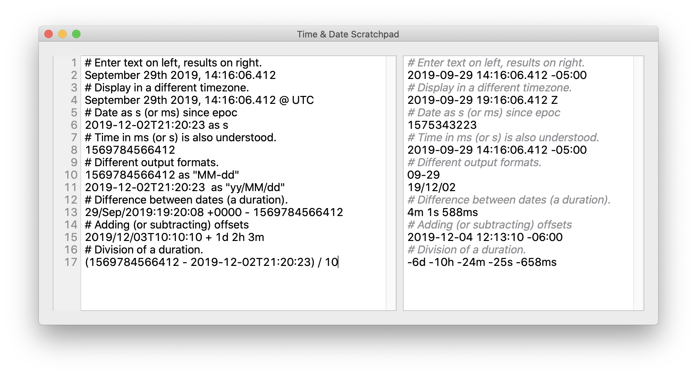

# TimeCalc

A scratch pad for time and date calculations. Type expressions on the left, see the results on the right.
For example how far apart are the date from a Kibana log message and the timesamp of a Cassandra column?

    September 6th 2017, 19:04:55.000 - 1504742693764001

Or, what's two minutes and 13 seconds after a time in seconds since epoc?

    1499212382 + 2m 13s

## Features / Functionality / Help

All of the features and functions are describe in the help files in markdown format in the [_English.lproj](TimeCalcHelp/_English.lproj) directory.

## Building

The only requirement beyond Xcode is [jekyll](https://jekyllrb.com) which is used together with the [Jekyll Apple Help](https://github.com/chuckhoupt/jekyll-apple-help) templates to  generate the OS X help docs. You can just follow the [jekyll installation instructions](https://jekyllrb.com/docs/installation/) to install jekyll.
