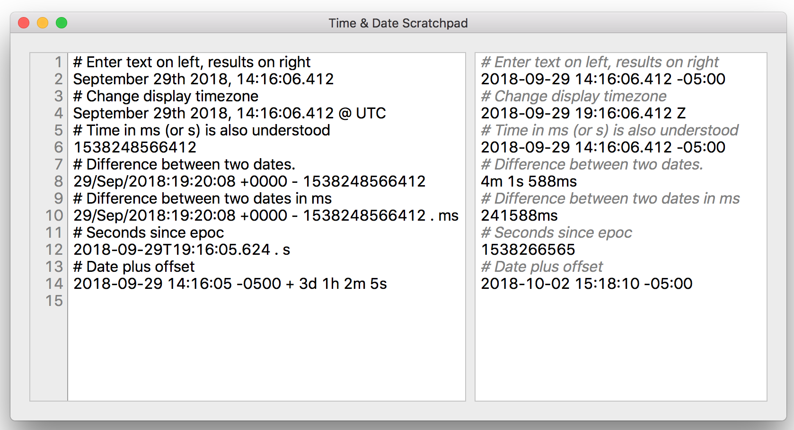

TimeCalc is a scratch pad for converting between different date formats and making calculations with dates
and durations. For example how far apart are the date from a Kibana log
message and the timesamp of a Cassandra column?

`September 6th 2017, 19:04:55.000 - 1504742693764001` it's `1s 235ms`

Or, what's two minutes and 13 seconds after a time in seconds since epoc?

`1499212382 + 2m 13s` it's `2017-07-04 18:55:15 -05:00`

Expressions are entered in the left pane and their values are displayed in the right pane. One
expression per line. A line that starts with `#` is a comment. Datetimes, durations and arithmetic
operations on them are supported. Whenever the text on the left is modified the results on the right are
recalculated.

